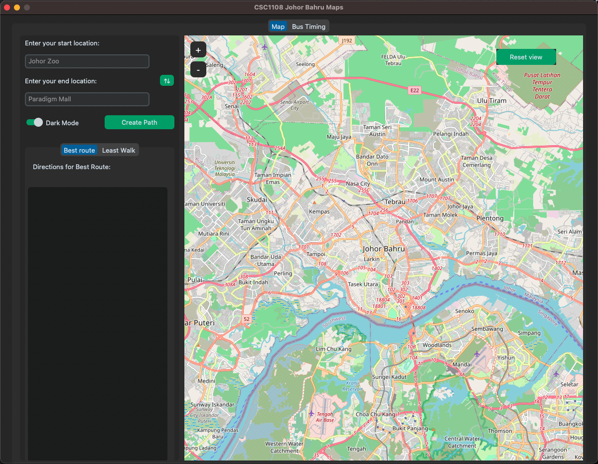
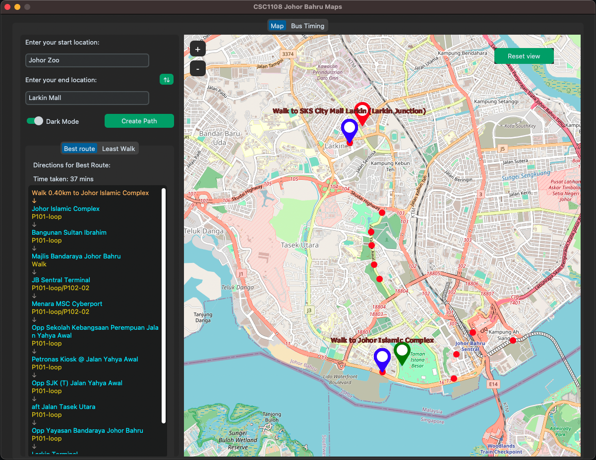

# CSC1108_Project
Prerequisite Downloads

In order to run the application successfully, you are strongly encouraged to download and install the packages listed below:

**1. Python 3.x: Python version 3.x or up is required.**

Latest version is recommended.

Download from: https://www.python.org/downloads/

**2. CustomTkinter: Python's GUI framework**
https://github.com/TomSchimansky/CustomTkinter

Run this command through the command line:
_pip3 install customtkinter_ or _py -m pip install customtkinter_ (alternative)

**3. TkinterMapView: TkinterMapView is a tile based interactive map renderer widget for the python Tkinter library**

Run this command through the command line:
_pip3 install tkintermapview_ or _py -m pip install customtkinter_ (alternative)

**4. geopy: geopy is Python client for several popular geocoding web services**

Run this command through the command line:
_pip3 install geopy or _py -m pip install geopy_ (alternative)

_To run the project, run **GUI.py**_
**GUI.py** define the frontend stuffs like generating the map and plotting of bus-stops according to the shortest path;

**brain.py** define the methods used to perform computation such as the dijkstra shortest path algorithm;

**Coordinates.py** define a class named 'Coordinates' to store the latiude and longtiude as attributesof a coordinate;

**json_generator.py** define methods that help to transform the data retrieved from the bus_stops.xlsx into json file;

**CollatedDataHelper.py** define a class named 'CollatedDataHelper' with methods that read and retrieve the data from the json file we generated at json_generator.py;

**collated_datav2.json** is a json file that contain data that will be used in the project.

#### Screenshots
Main screen:

Example of best route:

Example of least walk:

> This project is developed by Veleon Lim, Siong Yu, Peter Goh, Jasper Tan, Sean Koh as part of our school project.